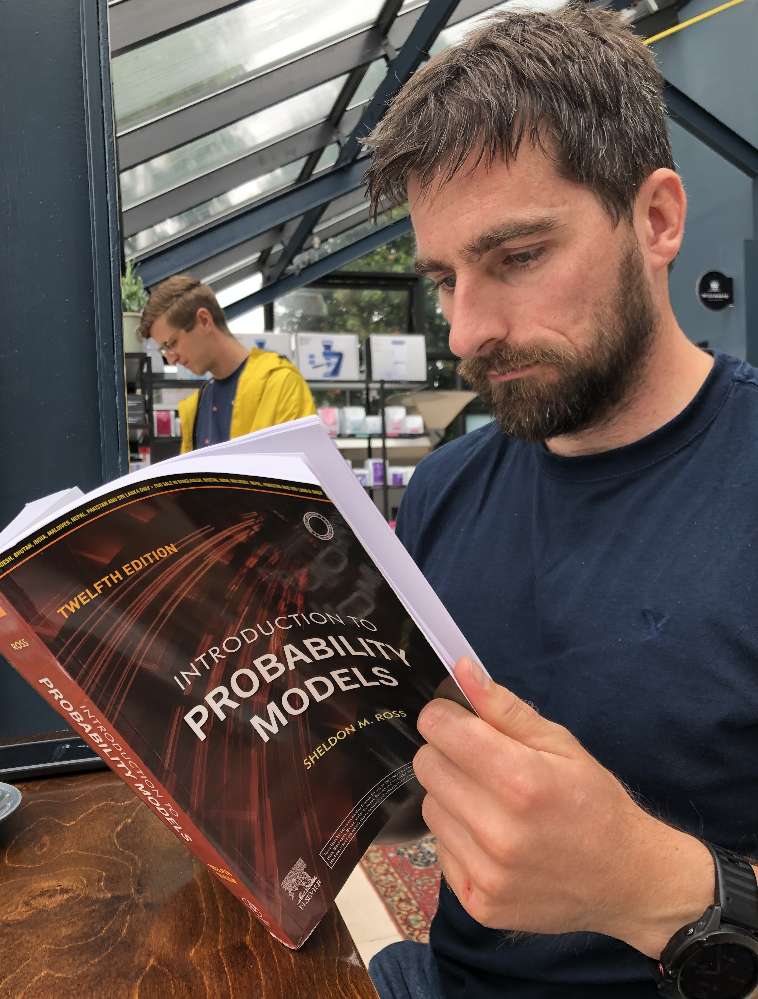

## About Me
I am a senior data scientist and head of research at [Kerno](https://kerno.io), working on augmenting AI agents with observability data to proactively fix production issues, and on graph analytics for micro services. I have a PhD in mathematics from the University of Oxford on dynamical processes on networks, and have done postdoctoral research on modelling and explainability of biological and artificial neural networks. My main research interests focus on modelling complex systems, and I have worked on problems in oceanography, meteorite recovery, analysing animal trajectories, and mathematical problems in industry for manufacturing and tech.

I still have a visiting position at the Wageningen Institute of Animal Sciences at Wageningen University and Research in the Netherlands where I'm working on biological neural networks and tools for analysis of animal tracks. Previously I worked on problems in oceanography and climate science at the University of Oxford, and on glaciology problems at the University of Manchester, both in the UK. 

## Selected Publications
- [Dynamical network models for melt ponds on sea ice](https://ora.ox.ac.uk/objects/uuid:4ae96b6c-bea2-4ad5-97ec-efee68210f7d) – Phd thesis, 2021
- [Topological Data Analysis Detects Percolation Thresholds in Arctic Melt-Pond Evolution](https://arxiv.org/pdf/2212.07961) - Arxiv preprint, 2022
- [A Hidden Layer of Meteorites Below the Ice Surface of Antarctica](https://research.manchester.ac.uk/files/30148017/POST-PEER-REVIEW-NON-PUBLISHERS.PDF) - Nature Communications, 2016

## Teaching
- Mathematical Geoscience, Autumn 2018 & Autumn 2009, Mathematical Institute, Oxford
- Networks, Spring 2017 & Spring 2018, Mathematical Institute, Oxford

## Contact
Email: michael.coughlan@wur.nl